<h1 align="center">Hi, I'm Pradnya 👋</h1>

  <strong>Fullstack Developer · Software Engineering Enthusiast</strong>

  Building responsive, maintainable, and user-focused software solutions.

  
  
  
  

---

## About Me

I am an **Informatics Education graduate** from **Universitas Pendidikan Ganesha**, focused on fullstack development, software engineering, artificial intelligence, and educational technology.

My academic research explored an **LLM-based diagnostic assessment system** designed to identify students' initial abilities and support more personalized learning.

### What I Do

* Develop responsive and maintainable fullstack web applications
* Build structured frontend interfaces with reusable components
* Design backend systems, APIs, databases, and application workflows
* Explore AI and LLM applications in educational technology
* Mentor students in C++ programming and competition preparation

## Technology Stack

  

## GitHub Activity

  

  
  

## Most Used Languages

  
  

  
    Statistics include aggregated activity from eligible public and private repositories.
    Private repository names and sensitive details remain hidden.
  

---

  <i>Building efficient, scalable, and meaningful technology solutions.</i>

